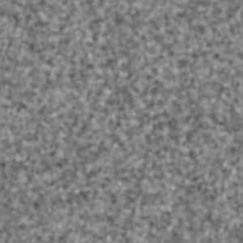

## Slide 2: General Information

1. Spatial Filter (formally 2D convolution) replaces an image filter with the weighted average of nearby pixels.

2. The filtered image is smoother, but the noise becomes correlated between pixels and care must be taken in interpreting resuls.

---

## Slide 3: The Key Features of server.R

1. Create a 300 X 300 array of normally diftributed pixel values, mean = 0, with standard deviation set by slider in UI.

2. Filter with "blur" function in spatstat package. Uses a radial gaussian kernal with standard deviation set by secon slider.

---

## Slide 4: The Key Features of ui.R

1. Two input parameters, with a slider control for each: 
#### (1). Piexl noise standard deviation 
#### (2). Filter width standard deviation

2. One ouput: 
#### The resulting image in PNG format

3. This app can be modified to allow selection of noise distribution, different kernels (box car, motion blur, edge detect, etc.)

---

## Slide 5: Acknowledge

### Brian Caffo, PhD
### Jeff Leek, PhD
### Roger D. Peng, PhD

---
